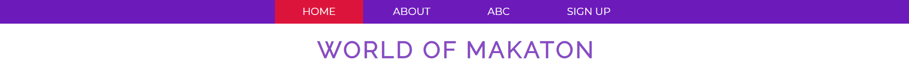
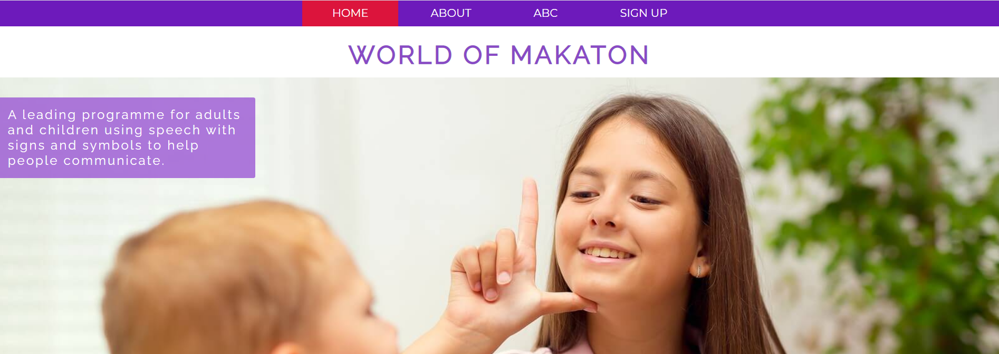
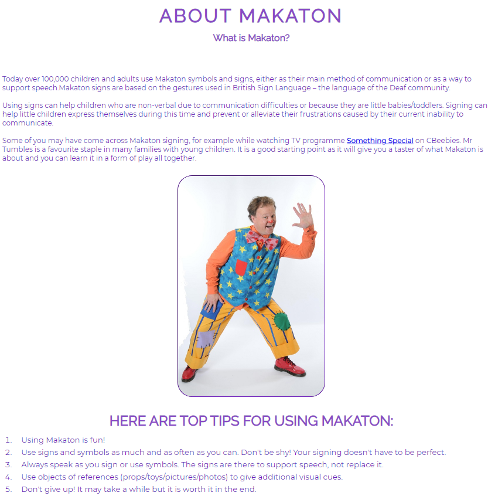
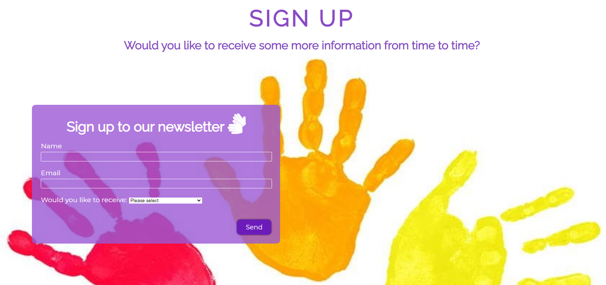

## **WORLD OF MAKATON**

The purpose of the World of Makaton website is to introduce more people to this wonderful and easy sign language which supports children and adults who may have learning difficulties and/or delays, to communicate better.

World of Makaton gives the user just enough information to get to know this form of communication and it gives some external pointers if they would like to know more about the background of it. 

<h2><strong>FEATURES:</strong></h2>

- Navigation: 
    - Navigation links are on top of each page on every screen size to take the user to a different page of the website.
          - It allows the user to easily navigate from page to page across all devices as the navbar is in fixed position even if you scroll through any page.
    - Sections of the navigation bar are: Home, About, ABC, and Sign Up.
        - Each page has a title > Home page - World of Makaton; About - About Makaton; ABC - ABC ... Alphabet; Sign Up - Sign Up.
    - Fonts and colors compliment the overall look of the website and are consistent throughout.

- <strong>Home page image:</strong>
    - The header shows the name of the website, using the a chosen color of purple shade (#894ac5). 
    - The header's tagline gives the user clear information about what the website is about.

- <strong>Footer:</strong>
    - Contains social media links leading to Faceboook, Twitter and YouTube and link to an email in form of icons. The links will open in a new tab to allow easy navigation and avoid using 'back' button to return to the page. The email link will open the user's choice of email software, i.e. desktop mail app/Outlook and the Email
    - Contains copyright information, including year of creation and my name

- <strong>About:</strong>
    - This section gives the user information about what Makaton (subject of the website) is, how it is used and the best tips on how to start learning it.
    - Image shows the character of Mr Tumbles from CBeebies shows 'Something Special'

- <strong>ABC:</strong>
    - This page contains images of the Makaton finger alphabet. Every single picture has a thin border to separate each image from each other and again allow better user experience

- <strong>Sign Up:</strong>
    - Sign up page has a form to collect user's details if they would like to receive news & updates
    - Form collects name, email and selection of newsletter type the user would like to receive
    - Users will be able choose if they would like to get text materials, video tutorials or informations about any running workshops. The user will be asked to submit their name and email address.

<strong>TESTING</strong>

------
info for me: In this section, you need to convince the assessor that you have conducted enough testing to legitimately believe that the site works well. Essentially, in this part you will want to go over all of your project’s features and ensure that they all work as intended, with the project providing an easy and straightforward way for the users to achieve their goals.

In addition, you should mention in this section how your project looks and works on different browsers and screen sizes.

You should also mention in this section any interesting bugs or problems you discovered during your testing, even if you haven't addressed them yet.

If this section grows too long, you may want to split it off into a separate file and link to it from here.
------

<h2><strong>VALIDATOR TESTING</strong></h2>

inc links to the validators to prove it

    > HTML (No errors were returned when passing through the official W3C validator) 
    > CSS (No errors were found when passing through the official (Jigsaw) validator)

Unfixed Bugs
------
info for me : You will need to mention unfixed bugs and why they were not fixed. This section should include shortcomings of the frameworks or technologies used. Although time can be a big variable to consider, paucity of time and difficulty understanding implementation is not a valid reason to leave bugs unfixed.
------

Deployment
------
This section should describe the process you went through to deploy the project to a hosting platform (e.g. GitHub)

The site was deployed to GitHub pages. The steps to deploy are as follows:
In the GitHub repository, navigate to the Settings tab
From the source section drop-down menu, select the Master Branch
Once the master branch has been selected, the page will be automatically refreshed with a detailed ribbon display to indicate the successful deployment.
The live link can be found here LINK
------

<h2><strong>CREDITS</strong></h2>
------
In this section you need to reference where you got your content, media and extra help from. It is common practice to use code from other repositories and tutorials, however, it is important to be very specific about these sources to avoid plagiarism.

You can break the credits section up into Content and Media, depending on what you have included in your project.
------

- Content
The text for the Home page was taken from Wikipedia Article A
Instructions on how to implement form validation on the Sign Up page was taken from Specific YouTube Tutorial
The icons in the footer were taken from ![Font Awesome] (https://fontawesome.com/)

- Media
The photos used on the home and sign up page are from This Open Source site
The images used for the gallery page were taken from this other open source site
Congratulations on completing your Readme, you have made another big stride in the direction of being a developer!

<h2><strong>BUGS</strong></h2>

Right at the beginning my page wasn't loading all the style changes. I realised I forgot to link the style.css file with the index.html file. Once I linked it, all was fixed.
I added the meta keywords and names at that time as well. 
