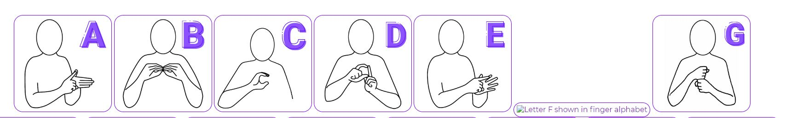

# **WORLD OF MAKATON**

The purpose of the World of Makaton website is to introduce more people to this wonderful and easy to learn sign language which supports children and adults who may have learning difficulties and/or delays, to communicate better.

I wanted to keep the site concise and easy to navigate through as there are multiple pages out there that are good as they contain lots of information about the subject but they are not very easy to navigate through and lots of important pieces of information are scattered over several pages.

World of Makaton gives the user a taster of this form of communication and it gives an external pointer to a TV programme which I'd highly recommend as it will help with learning sign language in form of fun and play. 

## **FEATURES:**

- **Navigation:**
    - Navigation links are on top of each page on every screen size to take the user to a different page of the website.
          - It allows the user to easily navigate from page to page across all devices as the navbar is in a fixed position even if you scroll through any page.
    - Sections of the navigation bar are: Home, About, ABC, and Sign Up.
        - Each page has a title:
            -   Home page - World of Makaton
            -   About - About Makaton
            -   ABC - ABC ... Alphabet
            -   Sign Up - Sign Up
    - Fonts and colors compliment the overall look of the website and are consistent throughout.

- **Home page image:**
    - The header shows the name of the website, using a chosen color of purple shade (#894ac5). 
    - The header's tagline gives the user clear information about what the website is about.

- **Footer:**
    - Contains social media links leading to Facebook, Twitter, and YouTube and a link to an email in form of icons. The links will open in a new tab to allow easy navigation and avoid using the back button to return to the page. The email link will open the user's choice of email software, i.e. desktop mail app/Outlook and the Email
    - Contains copyright information, including a year of creation and my name

- **About:**
    - This section gives the user information about what Makaton (subject of the website) is, how it is used, and the best tips on how to start learning it.
    - Image shows the character of Mr Tumbles from CBeebies shows 'Something Special' to which I included an external link for users to click on and be redirected into a new window.

- **ABC:**
    - This page contains images of the Makaton finger alphabet. Every single picture has a thin border to separate each image from each other and again allow a better user experience on all screen sizes. 

- **Sign Up:**
    - Sign up page has a form to collect user's details if they would like to receive news & updates
    - Form collects name, email, and selection of newsletter type the user would like to receive
    - Users will be able to choose if they would like to get text materials, video tutorials, or information about any running workshops. The user will be asked to submit their name and email address.

   
-  **Thank you page(hidden):**
    - After the user fills in the sign up form and clicks on Send button on Sign Up page, it will open up a new window to confirm their successful registration.     

## **TESTING**

As you can see in my [wireframes](wireframes/Makaton_wireframe_all.png), the layout was originally planned slightly differently, including the position and display of navbar. 

To improve user's experience and ease of navigation on smaller screens, I changed the navbar to be in a fixed position top of the page on every screen which then eliminated problems on mobile phone touchscreens as the padding area increased with this change and users are able to press the page links without any issues. 

I tested every page on iPad and iPhone 8, and I asked my friends and family to test the site on their mobile devices (Huawei, Xiaomi Redmi, and Samsung). They confirmed functionality of all pages and links, and they understood the objective of the website.

I tested the website in Chrome and Microsoft Edge on my desktop PC and screen resolution of 1920px by 1080px, and tested it on a laptop in Chrome, Mozilla, and Microsoft Edge.
All content was readable.

The [Home page](https://amartins87.github.io/world-of-makaton/index.html) showcases a cover text area which explains the subject of the website, the menu on top of the page will take you to other sections of the website. Footer has incorporate icons with links to external social media sites which will open in a new window. The mail icon will open preferred mail application on user's device or if not set, will ask about which application they would like to use. Email is preset with address of aneta.martins@outlook.com. 

The [About page](https://amartins87.github.io/world-of-makaton/about.html) explains briefly what is the subject of the website in paragraphs, shows an image of a character from a TV programme which I recommend to watch and shows an ordered list with more information. 

The [ABC page](https://8000-violet-platypus-kcwu1u8i.ws-eu13.gitpod.io/abc.html) has only images of the alphabet and a subheading which tells the user what the images are for. 

The [Sign Up page](https://8000-violet-platypus-kcwu1u8i.ws-eu13.gitpod.io/sign_up.html) contains a sign up form where a user has to write in their name, email and select an option of what materials they'd like to receive. All fields are required and won't allow submission without entries in a correct format like email addresses has to have certain characters to pass.
Once the user clicks on the Send button, it will open up a new page confirming successful registration.

------
info for me: In this section, you need to convince the assessor that you have conducted enough testing to legitimately believe that the site works well. Essentially, in this part, you will want to go over all of your project’s features and ensure that they all work as intended, with the project providing an easy and straightforward way for the users to achieve their goals.

In addition, you should mention in this section how your project looks and works on different browsers and screen sizes.

## **VALIDATOR TESTING**

-   HTML (No errors were returned when passing through the official W3C validator 
    -   [Home page](https://validator.w3.org/nu/?doc=https%3A%2F%2Famartins87.github.io%2Fworld-of-makaton%2Findex.html)
    -   [About page](https://validator.w3.org/nu/?doc=https%3A%2F%2Famartins87.github.io%2Fworld-of-makaton%2Fabout.html)
    -   [Abc page](https://validator.w3.org/nu/?doc=https%3A%2F%2Famartins87.github.io%2Fworld-of-makaton%2Fabc.html) - yellow warning - details in **Unfixed Bugs**
    -   [Sign Up page](https://validator.w3.org/nu/?doc=https%3A%2F%2Famartins87.github.io%2Fworld-of-makaton%2Fsign_up.html)
-   CSS (No errors were found when passing through the official [Jigsaw validator](https://jigsaw.w3.org/css-validator/validator$link)

## **ACCESSIBILITY**

I checked that the chosen colours and fonts are easy to read. All pages have passed through Lighthouse reporting tool in Chrome developer tools on both mobile and desktop.
- [Contrast checker - body text](wireframes/Contrast_checker_body.PNG)
- [Contrast checker - header text](wireframes/Contrast_checker_header.PNG)
- [Contrast checker - active class and hover selector](wireframes/Contrast_checker_active.PNG)

- [Lighthouse report - Home page - mobile](wireframes/accessibility/Lighthouse_mobile_report_home.PNG)
- [Lighthouse report - About page - mobile](wireframes/accessibility/Lighthouse_mobile_report_about.PNG)
- [Lighthouse report - Abc page - mobile](wireframes/accessibility/Lighthouse_mobile_report_abc.PNG)
- [Lighthouse report - Sign Up page - mobile](wireframes/accessibility/Lighthouse_mobile_report_signup.PNG)
- [Lighthouse report - Home page - desktop](wireframes/accessibility/Lighthouse_desktop_report_home.PNG)
- [Lighthouse report - About page - desktop](wireframes/accessibility/Lighthouse_desktop_report_about.PNG)
- [Lighthouse report - Abc page - desktop](wireframes/accessibility/Lighthouse_desktop_report_abc.PNG)
- [Lighthouse report - Sign Up page - desktop](wireframes/accessibility/Lighthouse_desktop_report_signup.PNG)

## **BUGS**

-   Right at the beginning my page wasn't loading all the style changes. I realized I forgot to link the style.css file with the index.html file. Once I linked it, all was fixed.

-   When I ran the code through a validator, an error popped up on my sign_up.html page in my '.form-section'. I have had set the target="_blanket" and it had strangely worked - a new page opened up in a new window. However the correct value is target="_blank". 

- When I resized images with TinyJPG, the Lighthouse report came back with low Best Practices, so I reverted to old sizes. All images uploaded well apart from letter F. I deleted and uploaded the image again and retyped the link path to letter F and the issue got fixed. 

    

- Got an error on my Lighthouse report about my external links in a footer and About page, stating links to cross-origin destinations are unsafe. Error was resolved by adding rel="noreferrer"

## **UNFIXED BUGS**

-   Yellow warning showed up on the ABC page due to the whole page section not having a heading element. There is no need to use a heading element within the section as the page contains only images of the finger alphabet. 

 
## **DEPLOYMENT**

The site was deployed to GitHub pages. The steps to deploy are as follows:
1.  In the GitHub repository, navigate to the **Settings** tab, then **Pages** section
2.  From the **Source** section drop-down menu, select the **Branch:main**
3.  Once the master branch has been selected, the page will be automatically refreshed with a detailed ribbon display to indicate the successful deployment.
4.  Now this site is live and published on https://amartins87.github.io/world-of-makaton/.

## **CREDITS**

- **Content**
    - My main point of reference for the written content was [Makaton website](https://makaton.org) to double-check that I wasn't going to write incorrect data and information.  

    - The icons in the footer were taken from [Font Awesome](https://fontawesome.com/)

- **Code**
    - I searched on [W3Schools](https://www.w3schools.com) when I looked for the best way to incorporate images on About and Alphabet pages. 

    - Code for the form page was taken from the Love Running project and only minor changes were made, like a change of font, image position, height, color scheme, and adding a code for cursor.

    - The select option code was advised to use by my mentor Maria Hynes as I couldn't implement a Required attribute to my previous checkbox option without using a javascript. 

- **Media**

    - Home page image was obtained via [Shutterstock](https://www.shutterstock.com/image-photo/brother-sister-learn-sign-language-home-450847297). 
    - About page image was obtained via official [Something Special magazine Twitter account](https://twitter.com/MyMrTumbleMag/status/980490147996360705?s=20). 
    - Abc page images were obtained via [Makaton website](https://makaton.org/TMC/Free_resources_.aspx) in their library which contains free resources for anyone who creates an account with the organization's website.
    - Sign Up page image inspiration came from our local children's centre where they have hanged images of kids' handprints in rainbow colors. The image was obtained via [Clip Art Best website](http://www.clipartbest.com/clipart-9i4ogx4GT) which are free to download and use in my designs. 
    - Image on the hidden Thank You page was obtained via [Makaton website](https://makaton.org/TMC/Free_resources_.aspx) from their library of free resources.

*This project is for educational purposes only.*